# `~$ zeen --role "Cybersecurity, Pentesting & Network Security"`

  

    

  <h3>
    <samp>Hi, I'm zeen 👋</samp>
  </h3>
  <h4>
    <samp>I focus on offensive security + system architecture.</samp> 
    <samp>Hunting vulnerabilities.</samp>
  </h4>

### ❯ ABOUT_ME

* ❖ **Objective:** Aspiring SOC Analyst & Penetration Tester.
* ❖ **Offensive Security:** Active on HackTheBox & TryHackMe (Network vulnerabilities & Privilege escalation).

---

### ❯ TECH_STACK

**[+] Languages**
 

**[+] Security & Networking**
 

**[+] OS & Environment**
 

**[+] Tools & Frameworks**
 

---

### ❯ SECURITY_PROFILES_&_LABS

**[+] [GitHub Profile](https://github.com/zeen404)**
* ❖ **Status:** Active
* ❖ **Focus:** Network practice, vulnerability tools (recon-toolkit), THNCA study notes (Obsidian), and software architecture.

**[+] [HackTheBox Profile](https://profile.hackthebox.com/profile/019e05a3-0d04-7049-b071-f1c6a6113bdd)**
* ❖ **Status:** Active
* ❖ **Focus:** Privilege Escalation, Linux Exploitation

**[+] [TryHackMe Profile](https://tryhackme.com/p/zeen404)**
* ❖ **Status:** Active
* ❖ **Focus:** Offensive Security Paths, Network Vulnerabilities

**[+] Current Operations**
* ❖ Preparing for SOC Analyst and Penetration Tester roles.
* ❖ Researching and implementing Software Design Patterns in TypeScript.

---

   
  <i>"root@zeen404:~# whoami && id"</i>
    
  

